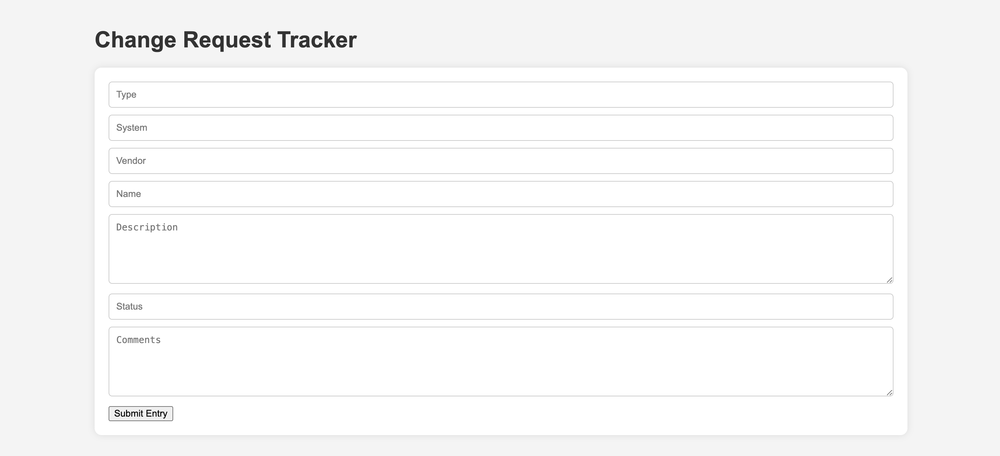
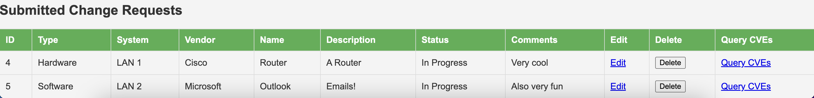

# Security Change Request Tracker
Simple, flask-based web app that lets you track change requests. Includes the ability to delete and edit requests, along with customizable fields.

## Baseline CR Form

## Baseline CR Table
